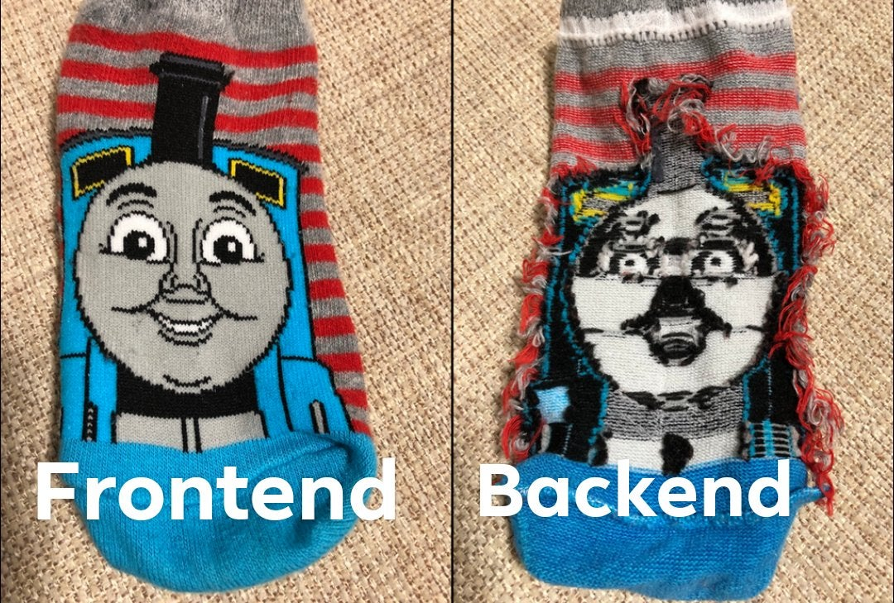

Blogpost Gruppe n

Blogpost Gruppe n

# Blogpost Gruppe 1

This might be the first sentence of your blogpost. Or you decide to change it - it's up to you! Either way you have to meet some regulatories.

Headlines are created with a leading '#', subheadlines with a '##'. Please don't use more levels of headlines.

## Introduction

Here you introduce the reader to your problem. It might help to add an image to clear things up.




## Method

Here you show how you solved the problem. Maybe you want to show some bulletpoints to guide the reader through

 - step 1
 - step 2 
 - step 42


It's also possible to add a .gif But this should be used with caution! It can get distracting and unprofessional easily.

## Project Result

Here you describe the project results. You're free in how you do it. Maybe again an image? But be aware even if an image may be worth thousands of words, it does not count as thousands of words!
Maybe you feel like embedding some few lines of code. But please be aware of the meaning of the word **few**.

```
import numpy as pd
import pandas as plt
import matplotlib.pyplot as np

# Some people want to see the world burn

df = plt.DataFrame(pd.array([1,2,3]))
````
 
If you need some formula [this](http://latex2png.com/) might come in handy to convert latex syntax to an image file. But you're free to use whatever you want as long as it produces image files. Please be aware adding formulas as images is the only feasible way to include math syntax. 


If you want to add captions just write them in a paragraph right under the image. Otherwise please skip one line. In Medium we will add the captions accordingly.


## Conclusion

Conclude what you archieved! You may add your names, and if you want also a link to your LinkedIn or GitHub.

Team Members:
- Techlabs Aachen, [LinkedIn](https://de.linkedin.com/showcase/techlabs-aachen)

## Export

After writing everything please export it into a single folder. You can share it with us e.g. via OneDrive or as a .zip file. The folder should be structured similar as following:

```
.
└── blogpost_gruppe_n/
	├── post.md
    └── images/
        ├── image_1
        ├── image_2
        ├── ...
        └── image_m
```

If you use the Joplin export function:
- please use the Option "markdown"
- Choose an empty folder as target
- Send the complete folder to us e.g. via OneDrive

It should then look something like this:

```
.
└── blogpost_gruppe_n/
    └── post/
        └── post.md
    └── _resources/
        ├── 70a56c8d78f3a2f2db9d81cb079.jpg
        ├── 072602f26fb3007296ce75da208.jpg
        ├── ...
        └── acaee1febda81f898cc1728c955.png
```

Thanks for your help and well done!

# Cheatsheet

# Headline
## Subheadline

- Bullet Point 1
- Bullet Point 2


1. Enumerate this
2. Enumerate that
3. Enumerate everything

```
Code Block
```

**bold**

[Link as displayed in text](actual-link.techlabs)


